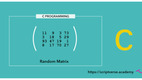

# Repositório de exercícios para Estrutura de Dados

- [Aquecimento](#aquecimento)
- [Recursão](#recursão)
- [Backtracking](#backtracking)
- [Arrays](#arrays)
- [List](#list)
- [Stack](#stack)
- [Queue](#queue)
- [Tree](#tree)

## Aquecimento
\________________________ | \_______________________________________________
------------------------- | ------------------------------------------------
 | [@106 L1 - {human} rand args](base/106/Readme.md#l1---human-rand-args)
 | [@029 L2 - {human} matrix](base/029/Readme.md#l2---human-matrix)
 | [@115 L1 - {human} png lab {optional}](base/115/Readme.md#l1---human-png-lab-optional)

## Recursão
\________________________ | \_______________________________________________
------------------------- | ------------------------------------------------
 | [@005 L1 - {robot} vector rec](base/005/Readme.md#l1---robot-vector-rec)
 | [@003 L1 - {robot} burn](base/003/Readme.md#l1---robot-burn)
 | [@004 L2 - {robot} triangle](base/004/Readme.md#l2---robot-triangle)
 | [@122 L2 - {human} fractals {optional}](base/122/Readme.md#l2---human-fractals-optional)

## Backtracking
\________________________ | \_______________________________________________
------------------------- | ------------------------------------------------
 | [@008 L2 - {robot} lab escape](base/008/Readme.md#l2---robot-lab-escape)
 | [@110 L2 - {human} lab create](base/110/Readme.md#l2---human-lab-create)
 | [@137 L3 - {human} lab corners {optional}](base/137/Readme.md#l3---human-lab-corners-optional)
 | [@010 L2 - {robot} distance](base/010/Readme.md#l2---robot-distance)
 | [@002 L2 - {human} distance create](base/002/Readme.md#l2---human-distance-create)
 | [@028 L2 - {robot} sudoku](base/028/Readme.md#l2---robot-sudoku)

## Arrays
\________________________ | \_______________________________________________
------------------------- | ------------------------------------------------
 | [@050 L1 - {robot} query](base/050/Readme.md#l1---robot-query)
 | [@060 L1 - {robot} rotation](base/060/Readme.md#l1---robot-rotation)
 | [@052 L2 - {robot} erase all](base/052/Readme.md#l2---robot-erase-all)
 | [@016 L2 - {robot} vector fup](base/016/Readme.md#l2---robot-vector-fup)
 | [@017 L2 - {robot} vector poo](base/017/Readme.md#l2---robot-vector-poo)
 | [@000 L2 - {robot} princess v1](base/000/Readme.md#l2---robot-princess-v1)
 | [@001 L2 - {robot} princess v2](base/001/Readme.md#l2---robot-princess-v2)

## List
\________________________ | \_______________________________________________
------------------------- | ------------------------------------------------
 | [@026 L1 - {robot} build list](base/026/Readme.md#l1---robot-build-list)
 | [@013 L2 - {robot} princess v1 list](base/013/Readme.md#l2---robot-princess-v1-list)
 | [@014 L2 - {robot} princess v2 list](base/014/Readme.md#l2---robot-princess-v2-list)
 | [@024 L3 - {robot} bank](base/024/Readme.md#l3---robot-bank)
 | [@015 L2 - {robot} editor](base/015/Readme.md#l2---robot-editor)
 | [@023 L4 - {robot} undo redo](base/023/Readme.md#l4---robot-undo-redo)

## Stack
\________________________ | \_______________________________________________
------------------------- | ------------------------------------------------
 | [@007 L2 - {robot} stack burn](base/007/Readme.md#l2---robot-stack-burn)
 | [@025 L2 - {robot} stack lab escape](base/025/Readme.md#l2---robot-stack-lab-escape)
 | [@112 L2 - {human} stack lab create](base/112/Readme.md#l2---human-stack-lab-create)
 | [@009 L3 - {robot} slide](base/009/Readme.md#l3---robot-slide)

## Queue
\________________________ | \_______________________________________________
------------------------- | ------------------------------------------------
 | [@006 L1 - {robot} double stack](base/006/Readme.md#l1---robot-double-stack)
 | [@051 L1 - {robot} crosses](base/051/Readme.md#l1---robot-crosses)
 | [@011 L2 - {robot} truck](base/011/Readme.md#l2---robot-truck)
 | [@019 L3 - {robot} pathfinding](base/019/Readme.md#l3---robot-pathfinding)

## Tree
\________________________ | \_______________________________________________
------------------------- | ------------------------------------------------
 | [@044 L2 - {robot} tree load](base/044/Readme.md#l2---robot-tree-load)
 | [@047 L2 - {robot} tree show](base/047/Readme.md#l2---robot-tree-show)
 | [@046 L2 - {robot} tree sum](base/046/Readme.md#l2---robot-tree-sum)
 | [@045 L2 - {robot} tree high deep](base/045/Readme.md#l2---robot-tree-high-deep)
 | [@022 L2 - {robot} tree path](base/022/Readme.md#l2---robot-tree-path)
 | [@048 L2 - {robot} tree serialize](base/048/Readme.md#l2---robot-tree-serialize)
