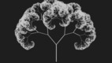
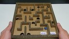
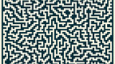
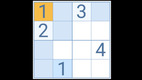
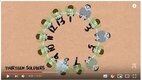
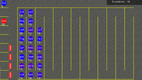
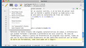
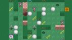
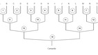
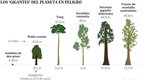

# Repositório de exercícios para Estrutura de Dados

## Links 
<!--TOC_BEGIN-->
- [Aquecimento](#aquecimento)
- [Recursão](#recursão)
- [Backtracking](#backtracking)
    - [Arrays](#arrays)
    - [List](#list)
    - [04. Stack](#04-stack)
    - [05. Queue](#05-queue)
    - [06. Tree](#06-tree)
    - [07. Sort](#07-sort)
    - [08. Hash](#08-hash)
- [Trabalhos](#trabalhos)
    - [01. Vector and List](#01-vector-and-list)
    - [02. Recursion](#02-recursion)
    - [03. Stack](#03-stack)
    - [04. Sort](#04-sort)
    - [05. Tree](#05-tree)
    - [06. Informativo](#06-informativo)
<!--TOC_END-->

## Aquecimento
\________________________ | \_______________________________________________
------------------------- | ------------------------------------------------
 | [@106 L1 - {interactive} Random matriz](base/106/Readme.md)
 | [@115 L1 - {interactive} Visualizando mat com xpaint {optional}](base/115/Readme.md)

## Recursão
\________________________ | \_______________________________________________
------------------------- | ------------------------------------------------
 | [@005 L1 - {onlinejudge} Operações básicas](base/005/Readme.md)
 | [@003 L1 - {onlinejudge} Queimada](base/003/Readme.md)
 | [@004 L2 - {onlinejudge} Triângulo da soma](base/004/Readme.md)
 | [@122 L2 - {interactive} Desenhando Fractais com xpaint {optional}](base/122/Readme.md)

## Backtracking
\________________________ | \_______________________________________________
------------------------- | ------------------------------------------------
 | [@008 L2 - {onlinejudge} Labirinto: fuga](base/008/Readme.md)
 | [@110 L2 - {interactive} Labirinto: criação](base/110/Readme.md)
 | [@137 L3 - {interactive} Labirinto: criação sem quinas {optional}](base/137/Readme.md)
 | [@010 L2 - {onlinejudge} Limite: resolução](base/010/Readme.md)
 | [@002 L2 - {interactive} Limite: criação](base/002/Readme.md)
 | [@028 L2 - {onlinejudge} Sudoku](base/028/Readme.md)

### Arrays
\________________________ | \_______________________________________________
------------------------- | ------------------------------------------------
 | [@050 L1 - {onlinejudge} Vetor de consulta](base/050/Readme.md)
 | [@060 L1 - {onlinejudge} Rotação à direira](base/060/Readme.md)
 | [@052 L2 - {onlinejudge} Fila de ingressos](base/052/Readme.md)
 | [@016 L2 - {onlinejudge} Construa um Vetor dinâmico I - Procedural](base/016/Readme.md)
 | [@017 L2 - {onlinejudge} Construa um Vetor dinâmico I - Orientado a Objetos](base/017/Readme.md)
 | [@000 L2 - {onlinejudge} Princesa V1 - Implementação em vetor](base/000/Readme.md)
 | [@001 L2 - {onlinejudge} Princesa V2 - Implementação em vetor](base/001/Readme.md)

### List
\________________________ | \_______________________________________________
------------------------- | ------------------------------------------------
 | [@013 L2 - {onlinejudge} Princesa V1 - Implementação usando o std::list](base/013/Readme.md)
 | [@014 L2 - {onlinejudge} Princesa V2 - Implementação usando std::list](base/014/Readme.md)
 | [@024 L3 - {onlinejudge} Simulação Fila Bancária](base/024/Readme.md)
 | [@015 L3 - {onlinejudge} Lista Editor de texto I](base/015/Readme.md)
 | [@023 L4 - {onlinejudge} Lista Editor de texto II - Undo e Redo](base/023/Readme.md)
 | [@026 L1 - {onlinejudge} Build Linked List - push and pop](base/026/Readme.md)

### 04. Stack
\________________________ | \_______________________________________________
------------------------- | ------------------------------------------------
 | [@006 L1 - Implementando Fila com duas Pilhas](base/006/Readme.md)
 | [@007 L2 - Queimada V2 - Pilha](base/007/Readme.md)
 | [@025 L2 - Labirinto II - Fuga com pilha](base/025/Readme.md)
 | [@009 L3 - Empurrando blocos escorregadios](base/009/Readme.md)

### 05. Queue
\________________________ | \_______________________________________________
------------------------- | ------------------------------------------------
 | [@051 L1 - Copa do mundo](base/051/Readme.md)
 | [@011 L2 - Passeio de caminhão](base/011/Readme.md)
 | [@019 L3 - Labirinto III - Fuga pelo menor caminho](base/019/Readme.md)

### 06. Tree
\________________________ | \_______________________________________________
------------------------- | ------------------------------------------------
 | [@044 L2 - Carregando árvore a partir de String](base/044/Readme.md)
 | [@047 L2 - Mostrando árvore tabulada](base/047/Readme.md)
 | [@046 L2 - Soma dos nós e Menor valor](base/046/Readme.md)
 | [@045 L2 - Find, Altura e Profundidade](base/045/Readme.md)
 | [@022 L2 - Caminhos para o nó](base/022/Readme.md)
 | [@048 L2 - Carregando árvore a partir de String - Splitted files](base/048/Readme.md)

### 07. Sort
\________________________ | \_______________________________________________
------------------------- | ------------------------------------------------
 | [@021 TODO: Sort Quick Sort](base/021/Readme.md)
 | [@020 TODO: Sort Bubble Selection Insertion](base/020/Readme.md)

### 08. Hash

## Trabalhos

### 01. Vector and List
 | [@113 L2 - Princesa Vector x List ](base/113/Readme.md)
 | [@142 L2 - Quando utilizar cada estrutura de dados?](base/142/Readme.md)
 | [@135 TODO (testar sfml e sdl) Lista Editor de texto interativo com sfml](base/135/Readme.md)

### 02. Recursion

### 03. Stack
 | [@112 L2 - Algoritmo de criação de labirinto com pilha](base/112/Readme.md)

### 04. Sort
 | [@139 TODO (update xpaint) Sort Visualizando ordenação](base/139/Readme.md)

### 05. Tree
 | [@134 TODO (puxar do site) Tree Árvore de Decisão](base/134/Readme.md)

### 06. Informativo
 | [@141 Estrutura de Dados e Algoritmos Ementa    ](base/141/Readme.md)
 | [@140 Apostilas de ED da Puc Rio  ](base/140/Readme.md)
 | [@143 Exemplos  Lista dupla com shared_ptr](base/143/Readme.md)
