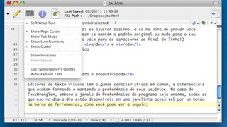

## __orphan__

||
-|-|-
@005 $01_rec__ 1. Rec Operações básicas|@004 $01_rec__ 2. Rec Triângulo da soma|@000 $02_array 1. Princesa V1 & Implementação em vetor

||
-|-|-
@001 $02_array 2. Princesa V2|@002 $02_array 3. Princesa V3|@016 $02_array 4. Build Vetor dinâmico

||
-|-|-
@052 $02_array Fila de ingressos|@050 $02_array Match Strings|@003 $03_maze_ 1. Queimada V1 chamada recursiva

||
-|-|-
@007 $03_maze_ 2. Queimada V2 Busca em profundidade|@011 $03_maze_ 3. Queimada V3 Busca em largura|@008 $03_maze_ 4. Labirinto Resolvendo com recursão

||
-|-|-
@017 $04_list_ 1. Build Lista Simples|@023 $04_list_ 2. Lista Editor de texto|@024 $04_list_ 2. Lista Simulação Fila Bancária

||
-|-|-
@049 $04_list_ Detecção de ciclo|@048 $04_list_ Inserir um nó no início de uma lista ligada|@027 $05_sort_ 1. Sort Bubble Selection Insertion

||
-|-|-
@028 $05_sort_ 2. Sort Quick Sort|@051 $05_stack Copa do mundo|@044 $06_tree_ 1. Tree Serialize and Show

||
-|-|-
@046 $06_tree_ 2. Tree Soma e Menor|@045 $06_tree_ 3. Tree Altura e Nível|@047 $06_tree_ 4. Tree Caminhos para o nó

