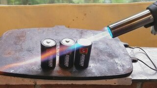
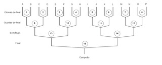

## 01_rec__

|||
-|-|-|-
@005 1. Rec Operações básicas|@004 2. Rec Triângulo da soma| | 

## 02_array

|||
-|-|-|-
@000 1. Princesa V1 & Implementação em vetor|@001 2. Princesa V2|@002 3. Princesa V3|@016 4. Build Vetor dinâmico

|||
-|-|-|-
@052 Fila de ingressos|@050 Match Strings| | 

## 03_maze_

|||
-|-|-|-
@003 1. Queimada V1 chamada recursiva|@007 2. Queimada V2 Busca em profundidade|@011 3. Queimada V3 Busca em largura|@008 4. Labirinto Resolvendo com recursão

## 04_list_

|||
-|-|-|-
@017 1. Build Lista Simples|@023 2. Lista Editor de texto|@024 2. Lista Simulação Fila Bancária|@049 Detecção de ciclo

|||
-|-|-|-
@048 Inserir um nó no início de uma lista ligada| | | 

## 05_sort_

|||
-|-|-|-
@027 1. Sort Bubble Selection Insertion|@028 2. Sort Quick Sort| | 

## 05_stack

|||
-|-|-|-
@051 Copa do mundo| | | 

## 06_tree_

|||
-|-|-|-
@044 1. Tree Serialize and Show|@046 2. Tree Soma e Menor|@045 3. Tree Altura e Nível|@047 4. Tree Caminhos para o nó

