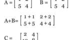

# Repositório de exercícios para Estrutura de Dados

- [Aquecimento](#aquecimento)
- [Recursão](#recursão)
- [Backtracking](#backtracking)
- [Arrays](#arrays)
- [List](#list)
- [Stack](#stack)
- [Queue](#queue)
- [Tree](#tree)

## Aquecimento

\________________________ | \_______________________________________________
------------------------- | ------------------------------------------------
 | [@012 L2 - Matriz Soma e Multiplicação](base/012/Readme.md#l2---matriz-soma-e-multiplicação)

## Recursão

\________________________ | \_______________________________________________
------------------------- | ------------------------------------------------
 | [@005 L1 - vector rec](base/005/Readme.md#l1---vector-rec)
 | [@003 L1 - burn](base/003/Readme.md#l1---burn)
 | [@002 L2 - triangle](base/002/Readme.md#l2---triangle)

## Backtracking

\________________________ | \_______________________________________________
------------------------- | ------------------------------------------------
 | [@008 L2 - lab escape](base/008/Readme.md#l2---lab-escape)
 | [@010 L2 - distance](base/010/Readme.md#l2---distance)
 | [@028 L3 - sudoku](base/028/Readme.md#l3---sudoku)

## Arrays

\________________________ | \_______________________________________________
------------------------- | ------------------------------------------------
 | [@050 L1 - query](base/050/Readme.md#l1---query)
 | [@060 L1 - rotation](base/060/Readme.md#l1---rotation)
 | [@052 L2 - erase all](base/052/Readme.md#l2---erase-all)
 | [@016 L2 - vector fup](base/016/Readme.md#l2---vector-fup)
 | [@017 L2 - vector poo](base/017/Readme.md#l2---vector-poo)
 | [@000 L2 - princess v1](base/000/Readme.md#l2---princess-v1)
 | [@001 L2 - princess v2](base/001/Readme.md#l2---princess-v2)

## List

\________________________ | \_______________________________________________
------------------------- | ------------------------------------------------
 | [@026 L1 - build list](base/026/Readme.md#l1---build-list)
 | [@013 L2 - princess v1 list](base/013/Readme.md#l2---princess-v1-list)
 | [@014 L2 - princess v2 list](base/014/Readme.md#l2---princess-v2-list)
 | [@024 L3 - bank](base/024/Readme.md#l3---bank)
 | [@015 L2 - editor](base/015/Readme.md#l2---editor)
 | [@023 L4 - undo redo](base/023/Readme.md#l4---undo-redo)

## Stack

\________________________ | \_______________________________________________
------------------------- | ------------------------------------------------
 | [@007 L2 - stack burn](base/007/Readme.md#l2---stack-burn)
 | [@025 L2 - stack lab escape](base/025/Readme.md#l2---stack-lab-escape)
 | [@009 L3 - slide](base/009/Readme.md#l3---slide)

## Queue

\________________________ | \_______________________________________________
------------------------- | ------------------------------------------------
 | [@006 L1 - double stack](base/006/Readme.md#l1---double-stack)
 | [@051 L1 - crosses](base/051/Readme.md#l1---crosses)
 | [@011 L2 - truck](base/011/Readme.md#l2---truck)
 | [@019 L3 - pathfinding](base/019/Readme.md#l3---pathfinding)

## Tree

\________________________ | \_______________________________________________
------------------------- | ------------------------------------------------
 | [@044 L2 - tree load](base/044/Readme.md#l2---tree-load)
 | [@047 L2 - tree show](base/047/Readme.md#l2---tree-show)
 | [@046 L2 - tree sum](base/046/Readme.md#l2---tree-sum)
 | [@045 L2 - tree high deep](base/045/Readme.md#l2---tree-high-deep)
 | [@022 L2 - tree path](base/022/Readme.md#l2---tree-path)
 | [@048 L2 - tree serialize](base/048/Readme.md#l2---tree-serialize)
