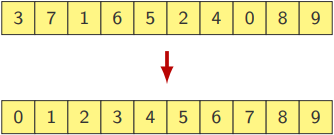
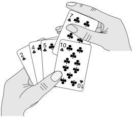

# Algoritmos de Ordenação

## Introdução

Os algoritmos de ordenação são métodos utilizados para organizar elementos de um vetor em ordem crescente ou decrescente. Essa medida é o primeiro passo na solução de muitos problemas práticos.

Um vetor pode ser ordenado de muitas maneiras diferentes: algumas elementares, outras mais sofisticadas e eficientes, escolhidas conforme o contexto e o tamanho dos dados a serem ordenados.

## Como Funciona?

O problema da ordenação de um vetor consiste em:

- Rearranjar os elementos de um vetor $A[0...n-1]$ de tal modo que ele se torne crescente, ou seja, de modo que $A[0] \leq ... \leq A[n-1]$.



## BubbleSort

O BubbleSort, ou ordenação por flutuação é um dos algoritmos de ordenação mais simples. A ideia consiste em percorrer um conjunto de elementos diversas vezes, e a cada passagem deve-se inverter elementos adjacentes fora de ordem.

De maneira geral:

- Do fim para o começo, vamos trocando pares invertidos
- Eventualmente, encontramos o menor elemento
- Ele será trocado com os elementos que estiverem antes


### Implementação do BubbleSort em C++

````cpp
void bubbleSort(int A[], int l, int r) {
    for (int i = l; i < r; i++) {
        for (int j = r; j > i; j--) {
            if (A[j] < A[j-1]) {
                int aux = A[j];
                A[j] = A[j-1];
                A[j-1] = aux;
            }
        }
    }
}
````

### Parando quando não há mais trocas

Se não aconteceu nenhuma troca, podemos parar o algoritmo.

````cpp
void bubbleSort_v2(int A[], int l, int r) {
    bool trocou = true;
    for (int i = l; i < r && trocou; i++) {
        trocou = false;
        for (int j = r; j > i; j--) {
            if (A[j] < A[j-1]) {
                std::swap(A[j], A[j-1]);
                trocou = true;
            }
        }
    }
}
````

## InsertionSort

O InsertionSort também é um algoritmo simples de ordenação. A ideia central do algoritmo é ordenar o vetor de maneira incremental, da esquerda para a direita, inserindo cada elemento na posição correta, como se estivéssemos ordenando cartas de um baralho.



- Se já temos $A[0], A[1], ..., A[i-1]$ ordenado, então inserimos $A[i]$ na posição correta.

### Passo a passo

- Assumimos que o elemento mais à esquerda está ordenado.
- Do restante dos elementos, pegamos o $j$ mais à esquerda e comparamos com o elemento ordenado à sua esquerda.
- Se o elemento ordenado é maior, devemos invertê-los. Caso contrário, nenhuma troca deve ser feita. Estes dois elementos estão agora ordenados.
- Devemos prosseguir para o próximo elemento $j$ a ser ordenado, ou seja, aquele mais à esquerda da porção não ordenada do vetor. Começando com o elemento mais à direita da porção ordenada do vetor, devemos comparar os valores e trocá-los caso o elemento já ordenado seja maior que $j$.
- Devemos seguir comparando $j$ com os elementos ordenados à sua esquerda até encontrarmos um que seja menor que este, ou quando não houver mais elementos à sua esquerda. Quando isso ocorrer, $j$ estará ordenado. Seguiremos para o próximo elemento.
- Quando todos os elementos forem ordenados, o vetor estará completamente ordenado.


### Implementação do InsertionSort em C++

````cpp
void insertionSort(int A[], int l, int r) {
    for (int j = l+1; j <= r; j++) {
        int key = A[j];
        int i = j-1;
        while (i >= l && A[i] > key) {
            A[i+1] = A[i];
            i--;
        }
        A[i+1] = key;
    }
}
````

## SelectionSort

Comparado aos outros algoritmos de ordenação, o SelectionSort é bastante direto. Ele consiste em percorrer um vetor um número de vezes e, a cada passagem, procurar o menor elemento e colocá-lo na posição mais à esquerda disponível.

Na primeira passagem, o menor valor é encontrado e colocado na posição 0. O resto do vetor desordenado é então vasculhado à procura do novo menor valor, que é colocado na posição 1 e assim sucessivamente. Para um vetor de $n$ elementos, serão necessárias $n$ voltas.


### Implementação do SelectionSort em C++

````cpp
void selectionSort(int A[], int l, int r) {
    for (int i = l; i < r; i++) {
        int indexMin = i;
        for (int j = i + 1; j <= r; j++) {
            if (A[j] < A[indexMin])
                indexMin = j;
        }
        int aux = A[i];
        A[i] = A[indexMin];
        A[indexMin] = aux;
    }
}
````

## Conclusão

Os algoritmos de ordenação, como BubbleSort, InsertionSort e SelectionSort, ajudam a organizar dados de maneira clara e estruturada. Cada um tem sua própria abordagem, mas todos são úteis para manter os dados em ordem, facilitando o acesso e a manipulação das informações.
