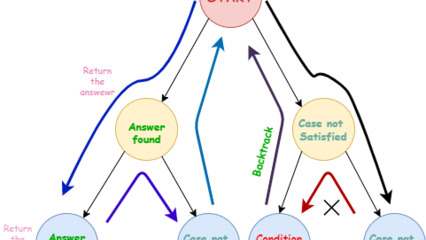

## $02_array 3. Princesa V3                            #done
## @qxcode

[](https://www.youtube.com/watch?v=uCsD3ZGzMgE)


Esse jogo é equivalente ao V2 porém com duas diferenças.
- Após matar, a espada salta um número de vezes igual ao último que utilizou a espada. Se o elemento que matou é positivo, a espada salta para direita, se não, salta para esquerda.

___
- Entrada:
    - Os valores de **N** e **E** e **F** na primeira linha.
- Saída:
    - Etapa a etapa, os elementos que estão vivos na fila circular.
        - Indicando com um > ou < quem está com a espada dependendo se é positivo ou negativo.


___
## Implementação com lista

Resolva novamente o problema cabeças vão rolar V3 utilizando uma lista ligada circular no lugar do vetor.

```c
struct Node{
    int value;
    Node * next;
    Node * prev;
};

```

___
## Testes:

```
>>>>>>>> 01
3 1 1
========
[ 1> -2 3 ]
[ 1 3> ]
[ 3> ]
<<<<<<<<

>>>>>>>> 02
3 2 1
========
[ 1 <-2 3 ]
[ <-2 3 ]
[ <-2 ]
<<<<<<<<

>>>>>>>> 03
3 3 1
========
[ 1 -2 3> ]
[ <-2 3 ]
[ <-2 ]
<<<<<<<<

>>>>>>>> 04
3 1 -1
========
[ <-1 2 -3 ]
[ -1 2> ]
[ 2> ]
<<<<<<<<

>>>>>>>> 05
3 2 -1
========
[ -1 2> -3 ]
[ -1 2> ]
[ 2> ]
<<<<<<<<

>>>>>>>> 06
3 3 -1
========
[ -1 2 <-3 ]
[ <-1 -3 ]
[ <-1 ]
<<<<<<<<

```


