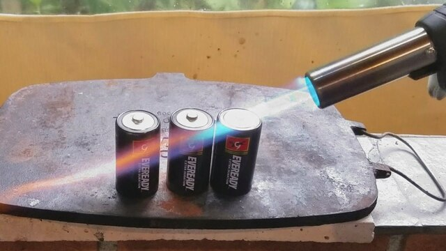

## $03_maze_ 3. Queimada V3 Busca em largura #todo
## @qxcode



Refaça o problema da queimada utilizando fila no lugar da recursão.


```
>>>>>>>> 01
2 3 1 1
#.#
.##
========
#.o
.oo
<<<<<<<<

>>>>>>>> 02
5 5 0 0
#..#.
#...#
###..
..#.#
..###
========
o..#.
o...#
ooo..
..o.o
..ooo
<<<<<<<<

>>>>>>>> 03
5 7 2 0
#..#.#.
#..####
###...#
..#.###
#.###..
========
o..o.o.
o..oooo
ooo...o
..o.ooo
#.ooo..
<<<<<<<<

>>>>>>>> 04
5 5 0 0
...#.
#...#
###..
..#.#
..###
========
...#.
#...#
###..
..#.#
..###
<<<<<<<<

>>>>>>>> 05
10 40 0 3
..####..##.##.#..#.#####.##.####.#.#.###
.##.####..#####.##..##.#.###...##.#.#.#.
.#....#..##.#...#.#.#..#.##.#.###.#.###.
.###.#.##.##.######.###..##..#####.#..##
.##########.##########.########.######.#
.########.#####.###.########.#..##.####.
###.###..##.#..###.#.##.##.###..####.###
..######..#.#..#.###.##......####..#.###
######.##.##.#.####.####.##############.
##.##.#.###.###........###.##.####.###..
========
..oooo..##.oo.o..o.ooooo.oo.oooo.#.#.###
.oo.oooo..ooooo.oo..oo.o.ooo...oo.#.#.#.
.o....o..oo.o...o.o.o..o.oo.#.ooo.#.###.
.ooo.o.oo.oo.oooooo.ooo..oo..ooooo.o..##
.oooooooooo.oooooooooo.oooooooo.oooooo.#
.oooooooo.ooooo.ooo.oooooooo.o..oo.oooo.
ooo.ooo..oo.o..ooo.o.oo.oo.ooo..oooo.ooo
..oooooo..o.o..o.ooo.oo......oooo..o.ooo
oooooo.oo.oo.#.oooo.oooo.oooooooooooooo.
oo.oo.#.ooo.###........ooo.oo.oooo.ooo..
<<<<<<<<

```
