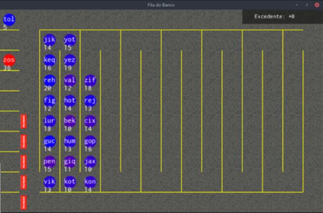

## L3 - ⚖ {onlinejudge} Simulação Fila Bancária



Neste trabalho, nós simularemos uma fila de banco. O nosso banco tem clientes que estão sendo atendidos no caixa e clientes em espera na fila. Cada cliente tem um nível de paciência (quantidade de tempo que ele pode esperar na fila) e uma quantidade de documentos a serem processados no caixa.

As variáveis que definem a execução são:

- Número de caixas
- Quantidade de clientes que chega por minuto
- Paciência dos clientes
- Quantidade de documentos que o cliente trás
- Limite máximo de pessoas no banco

Cada iteração representa um minuto passado no banco. Em cada iteração, cada `tic`, deve ser executado o seguinte pseudocódigo:

```
para todos os clientes na fila de saida
    remova cliente da fila
para todos os caixas
    se existe um cliente nesse caixa
        se o cliente tem documentos a serem processados
            processe um documento desse cliente
        senãdo
            mova cliente para fila de saída
    senão
        se houver clientes na fila de entrada
            pegue um cliente da fila de entrada e coloque nesse caixa
para cada cliente da fila de entrada
    se paciência desse cliente for maior que zero
        decremente um na paciência
    senão
        ponha esse cliente na fila de saída
```

## Guia

Você deve utilizar as seguintes estruturas para controlar o banco:
```cpp
struct Client{
    string id;
    int docs;
    int pac; 
};

struct Banco{
    vector<Client*> caixas;
    list<Client*> fila_entrada;
    queue<Client*> fila_saida;
};
```

## Testes

```bash
#__case one
# inicia a quantidade de caixas 
$init 3

# mostra os caixas, a fila de entrada e a fila de saída
$show
[][][]
in :{ }
out:{ }

# O comando 'in' adiciona um cliente na fila
# in _nome _acoes _paciencia
$in Ai 4 6
$in Bo 2 3
$in Ce 3 8
$in Di 3 5
$in Em 3 2

$show
[][][]
in :{ Ai:4:6 Bo:2:3 Ce:3:8 Di:3:5 Em:3:2 }
out:{ }

# O comando 'tic' faz passar um intervalo de tempo
$tic

$show
[Ai:4:6][Bo:2:3][Ce:3:8]
in :{ Di:3:4 Em:3:1 }
out:{ }

$tic

$show
[Ai:3:6][Bo:1:3][Ce:2:8]
in :{ Di:3:3 Em:3:0 }
out:{ }

$tic

$in Fa 4 5

$show
[Ai:2:6][Bo:0:3][Ce:1:8]
in :{ Di:3:2 Fa:4:5 }
out:{ Em:3:0 }

$tic
$show
[Ai:1:6][][Ce:0:8]
in :{ Di:3:1 Fa:4:4 }
out:{ Bo:0:3 }

$tic
$show
[Ai:0:6][Di:3:1][]
in :{ Fa:4:3 }
out:{ Ce:0:8 }

$tic
$show
[][Di:2:1][Fa:4:3]
in :{ }
out:{ Ai:0:6 }

$tic
$show
[][Di:1:1][Fa:3:3]
in :{ }
out:{ }

$tic
$show
[][Di:0:1][Fa:2:3]
in :{ }
out:{ }

$tic
$show
[][][Fa:1:3]
in :{ }
out:{ Di:0:1 }

$tic
$show
[][][Fa:0:3]
in :{ }
out:{ }

$tic
$show
[][][]
in :{ }
out:{ Fa:0:3 }

$tic
$show
[][][]
in :{ }
out:{ }

# se existirem clientes ainda no banco, continue passando o tempo até esvaziar o banco
# mostra quantos documentos foram processados pelo banco
# mostra quantos documentos foram perdidos pelo banco com clientes
# que desistiram
$finish
received: 16
lost: 5
tics: 6

# end termina a simulação
$end
```


