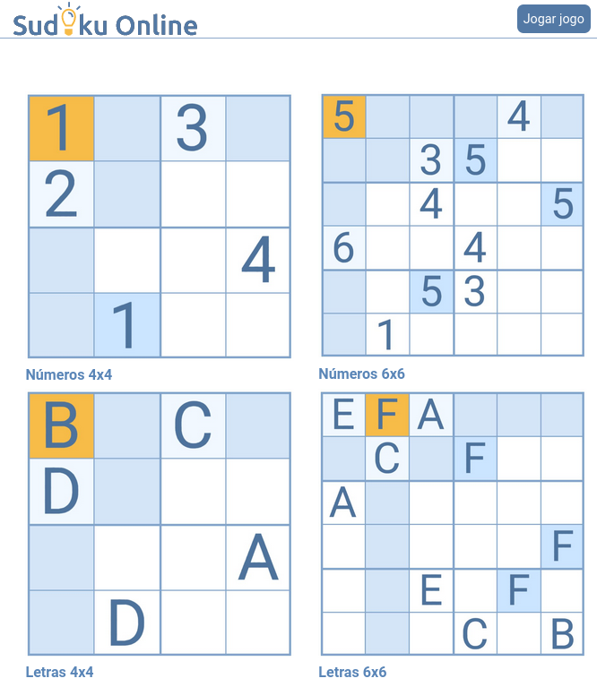

## L2 - {onlinejudge} Sudoku


O Sudoku tem várias versões para diferentes dificuldades. O mais conhecido é o modelo 9x9.

O site [sudoku](https://www.sudokuonline.io/pt/criancas) tem versões simplificadas para crianças com versões 4x4 e 6x6.



Seu objetivo é resolver um sudoku 4x4 com números de 1 a 4.

- Entrada
    - Uma matriz 4 x 4 composta por números de 1 a 4 e pontos para os valores faltantes.
- Saída
    - O problema resolvido.

```
>>>>>>>>
1.3.
2...
...4
.1..
========
<<<<<<<<

>>>>>>>>
..2.
.1..
..4.
.3..
========
<<<<<<<<


>>>>>>>>
....
.2.1
1.3.
....
========
<<<<<<<<

>>>>>>>>
....
3.2.
.1.4
....
========
<<<<<<<<


```


