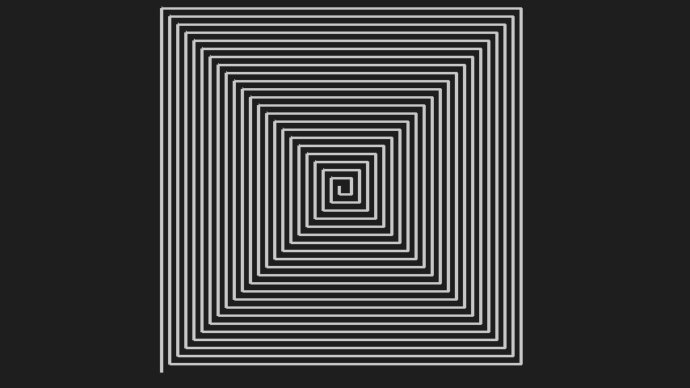
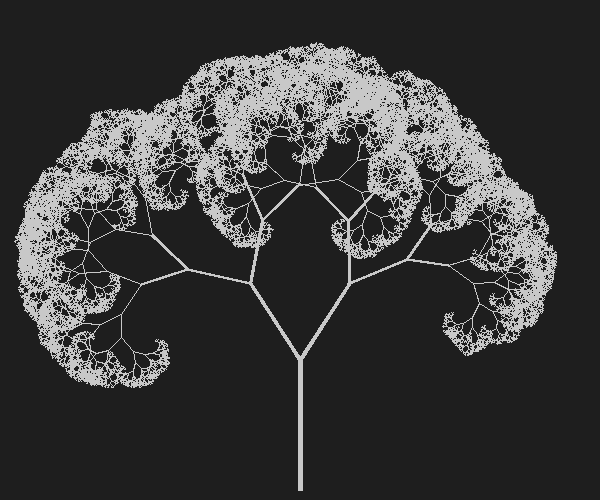
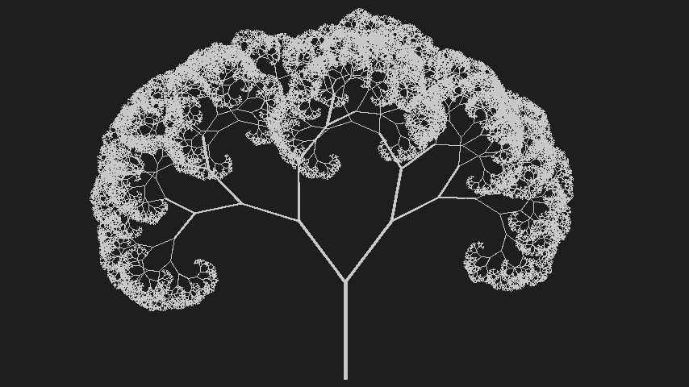
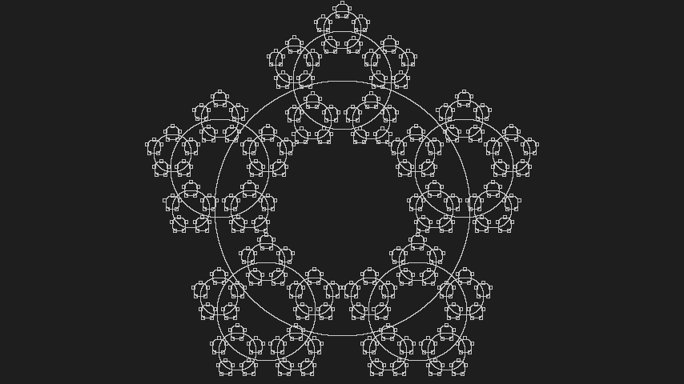
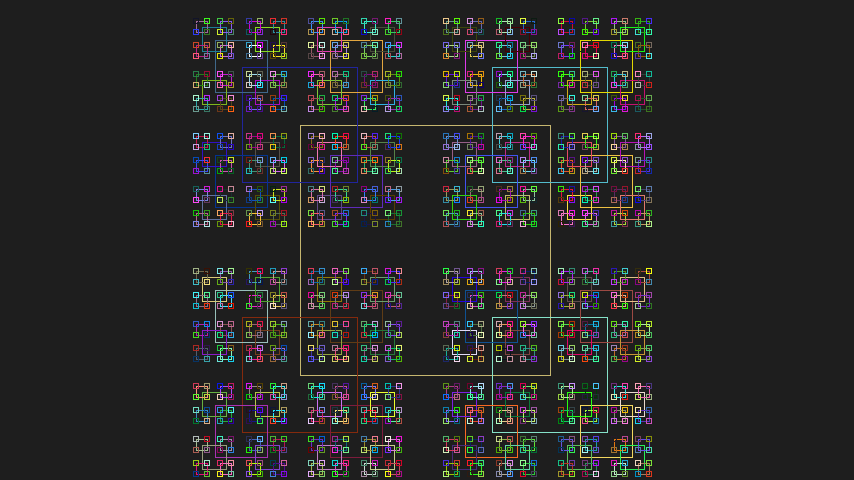
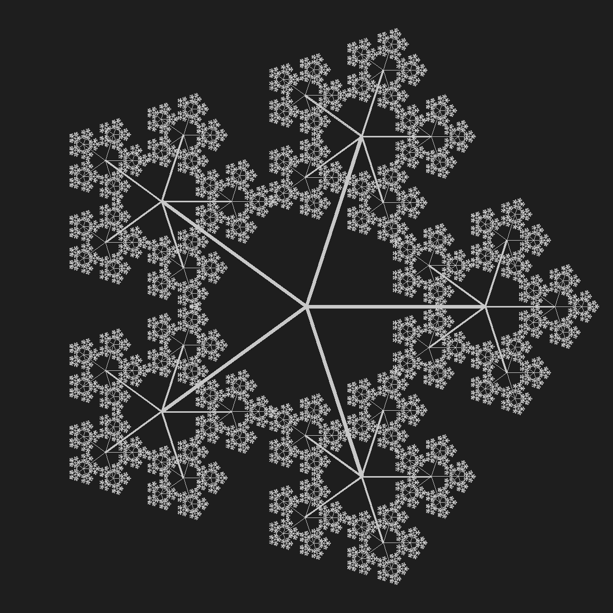
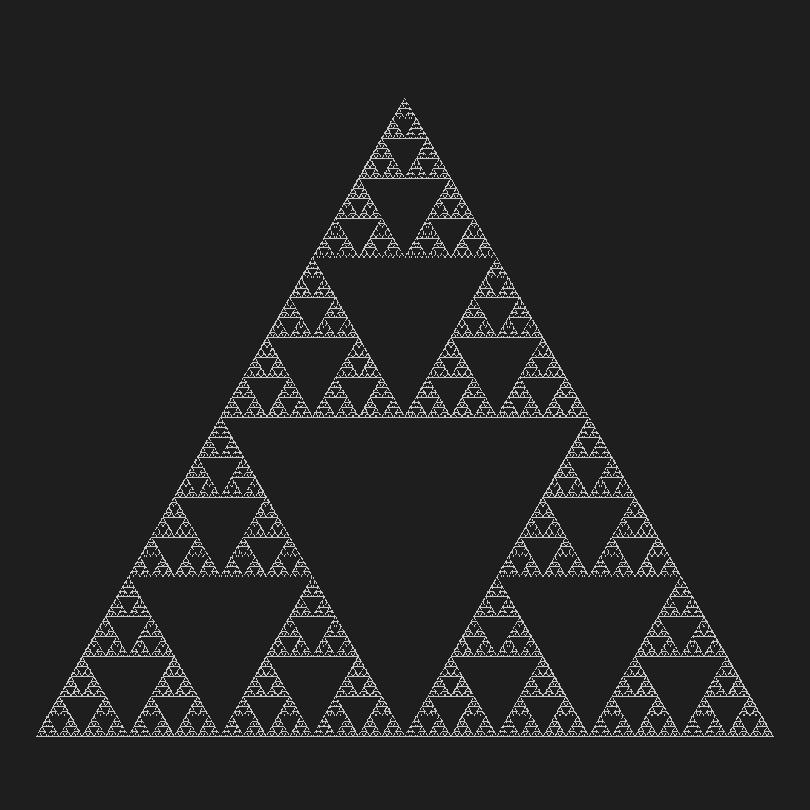

## L2 - {interactive} Desenhando Fractais com xpaint {optional}

- Utilize o exemplo do embuá ou da árvore e faça seus próprios fractais.
- Para baixar a biblioteca de desenho, basta baixar o arquivo [tk.h](https://raw.githubusercontent.com/senapk/xpaint/master/xpaint.h) e colocar na mesma pasta do projeto.

[embua.cpp](solver_embua.cpp)

___
[tree.cpp](solver_tree.cpp)

___
[circulos.cpp](solver_circulos.cpp)

___
[quadrados.cpp](solver_quadrados.cpp)

___
[gelo.cpp](solver_gelo.cpp)

___
[triangulo.cpp](solver_triangulo.cpp)
