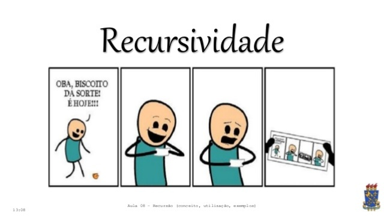

# Treinando recursão com vetores

<!-- toch -->
[Intro](#intro) | [Draft](#draft) | [Shell](#shell)
-- | -- | --
<!-- toch -->



## Intro

- Dado um vetor de inteiros, implemente funções recursivas para todas as operações solicitadas.
- Algumas funções vão precisar que você crie funções recursivas auxiliares.
- Ao terminar de implentar uma função, execute os testes e só vá para próxima após passar nos testes.
- Na seção Shell, você pode ver os testes que serão executados.
- Na seção Draft, você pode baixar manualmente os arquivos. Mas é mais prático utilizar o `tko`.

## Draft

<!-- links .cache/draft -->
- cpp
  - [main.cpp](.cache/draft/cpp/main.cpp)
- go
  - [main.go](.cache/draft/go/main.go)
<!-- links -->

___

## Shell
  
```bash
#__case tostr

$read
$tostr
[]

$read 4
$tostr
[4]

$read 4 5
$tostr
[4, 5]

$read 4 5 6
$tostr
[4, 5, 6]
$end
```

```bash
#__case torev

$read
$torev
[]

$read 4
$torev
[4]

$read 4 5
$torev
[5, 4]

$read 4 5 6
$torev
[6, 5, 4]

$end
```

```bash
#__case reverse

$read
$reverse
$tostr
[]

$read 4
$reverse
$tostr
[4]

$read 4 5
$reverse
$tostr
[5, 4]

$read 4 5 6
$reverse
$tostr
[6, 5, 4]

$end
```

```bash
#__case sum
$read
$sum
0

$read 4
$sum
4

$read 4 5
$sum
9

$read 4 5 6
$sum
15

$end
```

```bash
#__case mult
$read
$mult
1

$read 4
$mult
4

$read 4 5
$mult
20

$read 4 5 6
$mult
120

$end
```

```bash
#__case min
$read
$min
-1

$read 4
$min
0

$read 4 5
$min
0

$read 5 4
$min
1

$read 4 5 6
$min
0

$read 5 4 6
$min
1

$read 5 6 4
$min
2

$read 4 3 5 1 9 4 5
$min
3

$end
```
