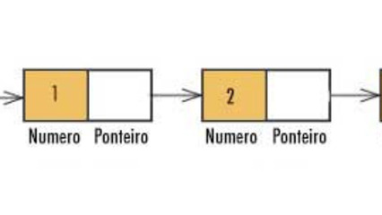

# Buffer Circular (Deque Dinâmico)

<!-- toch -->
[Intro](#intro) | [Guide](#guide) | [Shell](#shell)
-- | -- | --
<!-- toch -->



## Intro

- Vamos implementar um deque usando um buffer circular que cresce dinamicamente.
- O buffer usa um vetor circular interno e suporta inserção e remoção tanto na frente quanto no fim.
- A capacidade inicial é de 4 elementos, e ela dobra automaticamente se necessário.

## Guide

Esse deque simula uma lista de dois lados usando um vetor circular. Os índices de cabeça (`head`) e cauda (`tail`) controlam a posição de leitura e escrita. A estrutura cresce quando está cheia, mantendo a ordem correta dos elementos.

## Shell

```bash
#TEST_CASE size
$size
0
$push_front 4
$show
[4]
$size
1
$push_front 3 2 1
$show
[1, 2, 3, 4]
$size
4
$end
```

```bash
#TEST_CASE clear
$push_front 1 2 3 4
$show
[4, 3, 2, 1]
$clear
$show
[]
$clear
$show
[]
$push_front 1 2 3 4
$show
[4, 3, 2, 1]
$end
```

```bash
#TEST_CASE push_back <value ...>
$push_back 1 2 3 4
$show
[1, 2, 3, 4]
$push_back 1 2 3 4
$show
[1, 2, 3, 4, 1, 2, 3, 4]
$push_front 0 3
$show
[3, 0, 1, 2, 3, 4, 1, 2, 3, 4]
$end
```

```bash
#TEST_CASE pop_front
$push_back 1 3 4 5
$show
[1, 3, 4, 5]
$pop_front
$show
[3, 4, 5]
$pop_front
$show
[4, 5]
$pop_front
$show
[5]
$pop_front
$show
[]
$pop_front
fail: buffer vazio
$show
[]
$end
```

```bash
#TEST_CASE pop_back
$push_back 1 3 4 5
$show
[1, 3, 4, 5]
$pop_back
$show
[1, 3, 4]
$pop_back
$show
[1, 3]
$pop_back
$show
[1]
$pop_back
$show
[]
$pop_back
fail: buffer vazio
$show
[]
$end
```
