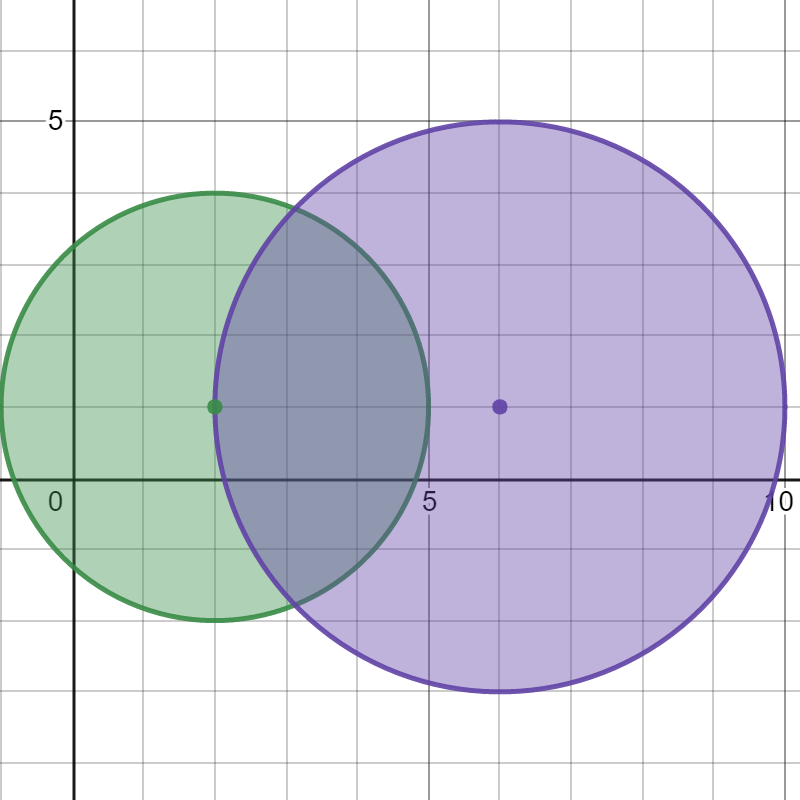

# LeetCode 2101. Detonate the Maximum Bombs

## Intro

Você recebe uma lista de bombas. O alcance de uma bomba é definido como a área onde seu efeito pode ser sentido, que tem formato circular com o centro na posição da bomba.  

As bombas são representadas por uma matriz 2D de inteiros `bombs`, onde `bombs[i] = [xi, yi, ri]`.  
- `xi` e `yi` indicam a coordenada X e Y da bomba `i`.  
- `ri` indica o raio de alcance da bomba `i`.  

Você pode escolher **detonar apenas uma bomba**.  
Quando uma bomba é detonada, todas as bombas dentro do seu alcance também detonam.  
Essas bombas, por sua vez, detonam todas as bombas dentro de seus respectivos alcances.  

Retorne o **número máximo de bombas que podem ser detonadas** se você puder detonar apenas uma bomba inicialmente.

Segue uma representação visual do teste 1.

## Submission

Aqui, copiamos apenas alguns casos de teste do problema original, ao final, submeta seu código no LeetCode [nesse link](https://leetcode.com/problems/detonate-the-maximum-bombs/).

## Tests

```txt
>>>>>>>> INSERT Teste 1
2 3
2 1 3
6 1 4
======== EXPECT
2
<<<<<<<< FINISH


>>>>>>>> INSERT Teste 2
2 3
1 1 5
10 10 5
======== EXPECT
1
<<<<<<<< FINISH


>>>>>>>> INSERT Teste 3
5 3
1 2 3
2 3 1
3 4 2
4 5 3
5 6 4
======== EXPECT
5
<<<<<<<< FINISH
```

## Constraints

- `1 <= bombs.length <= 100`

- `bombs[i].length == 3`

- `1 <= xi, yi, ri <= 10^5`