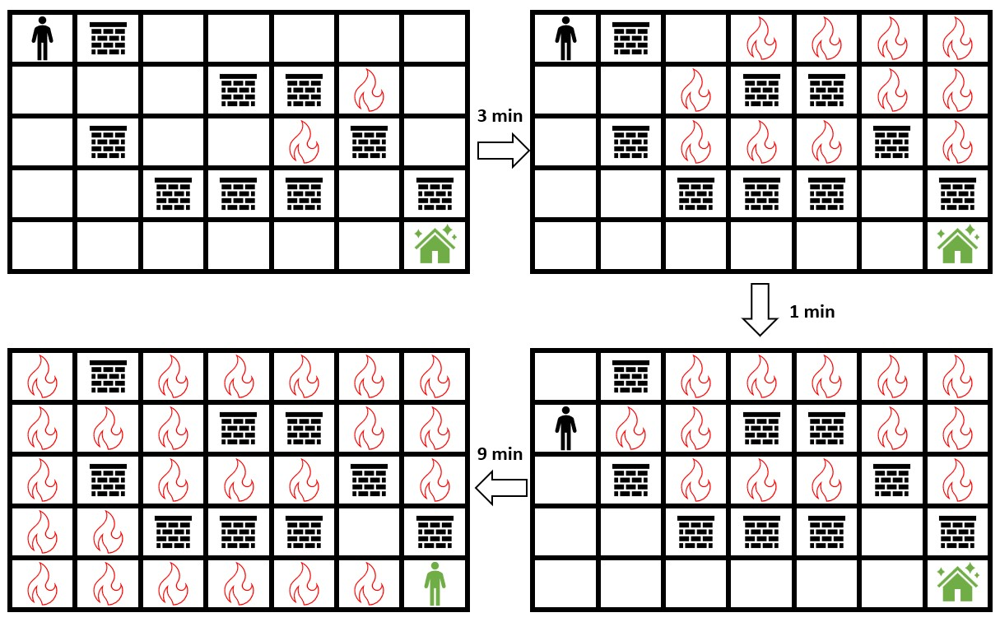

# LeetCode 2258. Escape the Spreading Fire

## Intro

Você recebe uma matriz inteira `grid` 2D de tamanho `m x n` que representa um campo. Cada célula tem um dos três valores:

- `0` representa grama,  
- `1` representa fogo,  
- `2` representa uma parede que nem você nem o fogo podem atravessar.  

Você está situado na célula superior esquerda `(0, 0)` e quer chegar ao **abrigo seguro** na célula inferior direita `(m - 1, n - 1)`.  

A cada minuto:  
1. Você pode se mover para uma célula de grama adjacente (cima, baixo, esquerda ou direita).  
2. Em seguida, cada célula com fogo se espalha para todas as células adjacentes que não sejam paredes.  

Retorne o **número máximo de minutos que você pode permanecer na posição inicial** antes de começar a se mover e ainda assim chegar com segurança ao abrigo.  

- Se for impossível chegar com segurança, retorne `-1`.  
- Se você sempre conseguir alcançar o abrigo independentemente de quanto tempo esperar, retorne `10^9`.  

Segue uma represnetação visual do teste 1.

## Submission

Aqui, copiamos apenas alguns casos de teste do problema original, ao final, submeta seu código no LeetCode [nesse link](https://leetcode.com/problems/escape-the-spreading-fire/).

## Tests

```txt
>>>>>>>> INSERT Teste 1
5 7
0 2 0 0 0 0 0
0 0 0 2 2 1 0
0 2 0 0 1 2 0
0 0 2 2 2 0 2
0 0 0 0 0 0 0
======== EXPECT
3
<<<<<<<< FINISH


>>>>>>>> INSERT Teste 2
3 4
0 0 0 0
0 1 2 0
0 2 0 0
======== EXPECT
-1
<<<<<<<< FINISH


>>>>>>>> INSERT Teste 3
3 3
0 0 0
2 2 0
1 2 0
======== EXPECT
1000000000
<<<<<<<< FINISH
```

## Constraints

- `m == grid.length`

- `n == grid[i].length`

- `2 <= m, n <= 300`

- `4 <= m * n <= 2 * 10^4`

- `grid[i][j] é 0, 1 ou 2`

- `grid[0][0] == grid[m - 1][n - 1] == 0`