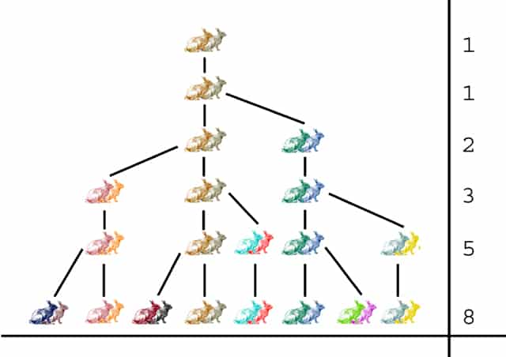

# L2 - @fibonacci - Procriando coelhos

Uma relação de recorrência é uma forma de definir os termos de uma sequência em relação aos valores dos termos anteriores. No caso dos coelhos de Fibonacci, qualquer mês conterá os coelhos que estavam vivos no mês anterior além de sua nova prole. Uma observação importante é que o número de descendentes em qualquer mês é igual ao número de coelhos que estavam vivos dois meses antes.



Como resultado, se $F_n$ representa o número de pares de coelhos vivos após n -ésimo mês, então obtemos a sequência de Fibonacci com termos que são definidos pela relação de recorrência $F_n=F_{n−1}+F_{n−2}$ (com F1=F2=1 para iniciar a sequência). Embora a sequência tenha o nome de Fibonacci, ela era conhecida pelos matemáticos indianos há mais de dois milênios.

Faça um programa que calcula o número total de pares de coelhos que estarão presentes após $n$ meses, se começarmos com 1 par e em cada geração, cada par de coelhos em idade reprodutiva produz uma ninhada de $k$ pares de coelhos (em vez de apenas 1 par).

## Entrada

A entrada é composta por uma única linha contendo dois inteiros ($1 \leq n \leq 1 0$) e ($1 \leq k \leq 10$)

## Saída

A saída é composta por uma única linha contendo o número total de pares de coelhos que estão presentes após n meses, se começarmos com 1 par e em cada geração, cada par de coelhos em idade reprodutiva produz uma ninhada de $k$ pares de coelhos.

## Exemplo de Entrada

```txt
5 3
```

## Exemplo de Saída

```txt
19
```
