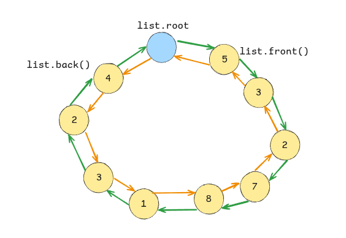

# Lista Dupla com Nó Sentinela

<!-- toch -->
[Intro](#intro) | [Guide](#guide) | [Shell](#shell)
-- | -- | --
<!-- toch -->



## Intro

- Vamos implementar uma lista duplamente encadeada com nó sentinela (nó de marcação). Esse modelo de implementação é o mais comum em linguagens como C/C++, Java, Go, Rust, etc.
- A excessão é o python, que tem uma implementação diferente, ao invés de usar nós que unem elementos individuais, ele faz nós que unem listas inteiras. Isso é mais eficiente, mas não é o que vamos fazer aqui.

## Guide

Nessa lista, teremos um único `Node` chamado `root` que marca tanto o início como o fim da lista, ele é chamado de nó sentinela ou nó de marcação. Esse nó não contém dados, apenas aponta para o primeiro e o último nó válidos da lista. Se a lista estiver vazia, o nó sentinela aponta para ele mesmo.

No arquivo `extra.md` de cada linguagem, você terá as instruções da implementação.

## Shell

```bash

#TEST_CASE init e empty show
$show
[]
$end
```

```bash
#TEST_CASE push_front <value ...>
$push_front 1 2 3 4
$show
[4, 3, 2, 1]
$push_front 9 6
$show
[6, 9, 4, 3, 2, 1]
$end
```

```bash
#TEST_CASE size
$size
0
$push_front 4
$show
[4]
$size
1
$push_front 3 2 1
$show
[1, 2, 3, 4]
$size
4
$end
```

```bash
#TEST_CASE clear
$push_front 1 2 3 4
$show
[4, 3, 2, 1]
$clear
$show
[]
$clear
$show
[]
$push_front 1 2 3 4
$show
[4, 3, 2, 1]
$end
```

```bash
#TEST_CASE push_back <value ...>
$push_back 1 2 3 4
$show
[1, 2, 3, 4]
$push_back 1 2 3 4
$show
[1, 2, 3, 4, 1, 2, 3, 4]
$push_front 0 3
$show
[3, 0, 1, 2, 3, 4, 1, 2, 3, 4]
$end
```

```bash
#TEST_CASE pop_front
$push_back 1 3 4 5
$show
[1, 3, 4, 5]
$pop_front
$show
[3, 4, 5]
$pop_front
$show
[4, 5]
$pop_front
$show
[5]
$pop_front
$show
[]
$pop_front
$show
[]
$end
```

```bash
#TEST_CASE pop_back
$push_back 1 3 4 5
$show
[1, 3, 4, 5]
$pop_back
$show
[1, 3, 4]
$pop_back
$show
[1, 3]
$pop_back
$show
[1]
$pop_back
$show
[]
$pop_back
$show
[]
$end
```
