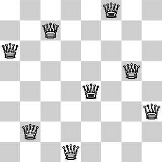

# N-Rainhas



O problema das **N-Rainhas** consiste em posicionar `N` rainhas em um tabuleiro de xadrez `N x N` de forma que **nenhuma rainha ataque outra**. Ou seja:

- Nenhuma rainha pode estar na **mesma linha**
- Nenhuma rainha pode estar na **mesma coluna**
- Nenhuma rainha pode estar na **mesma diagonal**

Dado um número inteiro `n`, encontrar **todas as soluções possíveis** para posicionar `n` rainhas em um tabuleiro `n x n` de modo que nenhuma possa atacar a outra.

---

## Entrada

A entrada consiste em um único número inteiro:

- `n` — número de rainhas e dimensão do tabuleiro  
  $1 \leq n \leq 15$

## Saída

- Quantidades de maneiras possíveis para posicionar `n` rainhas em um tabuleiro `n x n`

## Exemplos

<!-- load tests.toml --tests 3 -->
```py
>>>>>>>> INSERT
1
======== EXPECT
1
<<<<<<<< FINISH
```

```py
>>>>>>>> INSERT
2
======== EXPECT
0
<<<<<<<< FINISH
```

```py
>>>>>>>> INSERT
3
======== EXPECT
0
<<<<<<<< FINISH
```
<!-- load -->
