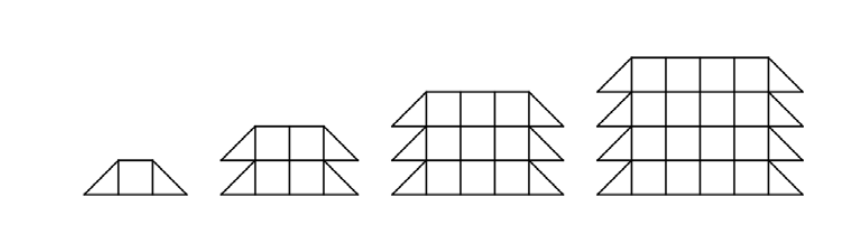

# L2 - @padroes2 - Descobrindo quantas pecinhas

Considere a seguinte sequência de imagem:



Cada imagem na sequência é formada por um número de peças (uma peça pode ser um quadrado ou triângulo).

A tabela seguinte apresenta uma relação entre a ordem da imagem na sequência e o número total de peças utilizadas:

| ordem                | 1 | 2 | 3  |
|----------------------|---|---|----|
| número de peças      | 3 | 8 | 15 |

Faça um programa que recebe um inteiro `n` e devolve o número total de peças da n-ésima imagem da sequência.

## Entrada

A entrada é composta por uma única linha contendo um inteiro `n` representando a posição de um padrão na sequência.

## Saída

A saída é composta por uma única linha contendo o total de peças da n-ésima imagem da sequência.

## Exemplo de Entrada

```txt
3
```

## Exemplo de Saída

```txt
15
```
