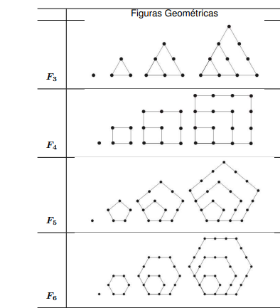

# Descobrindo quantos pontos

<!-- toch -->
[Intro](#intro) | [Entrada](#entrada) | [Saída](#saída) | [Exemplos](#exemplos)
-- | -- | -- | --
<!-- toch -->

## Intro

Considere as seguintes sequências de figuras geométricas:



Dado dois inteiros $3 \leq n \leq 20$ e $ 1 \leq m \leq 40$, encontre o número de pontos da m-ésima figura da sequência $F_n$. Por exemplo, a segunda figura da sequência $F_3$ é formada por 3 pontos.

## Entrada

A entrada consiste em uma única linha que contém dois números inteiros, n e m. Esses números representam, respectivamente, a sequência e a posição m-ésima na sequência $F_n$.

## Saída

A saída é composta por uma única linha contendo o número total de pontos.

## Exemplos

<!-- load tests.toml --tests 3 -->
```py
>>>>>>>> INSERT
3 1
======== EXPECT
1
<<<<<<<< FINISH
```

```py
>>>>>>>> INSERT
3 2
======== EXPECT
3
<<<<<<<< FINISH
```

```py
>>>>>>>> INSERT
3 3
======== EXPECT
6
<<<<<<<< FINISH
```
<!-- load -->
