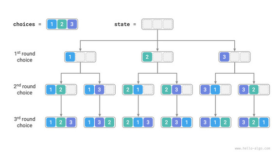

# Permutando coisas



O problema de **Permutações** consiste em listar **todas as permutações distintas** de uma *string de caracteres*.

Por exemplo, para a palavra `"abc"`, as permutações são:

`[abc, acb, bac, bca, cab, cba]`

## Entrada

A entrada consiste em uma única string com até `6` caracteres (sem espaços):

- `s` — string de entrada  
  `1 ≤ |s| ≤ 6`  
  Os caracteres são únicos.

## Saída

- Uma lista com **todas as permutações distintas** da string de entrada, **ordenadas lexicograficamente**, uma por linha.

## Exemplos

<!-- load tests.toml --tests 3 -->
```py
>>>>>>>> INSERT
abcd
======== EXPECT
abcd
abdc
acbd
acdb
adbc
adcb
bacd
badc
bcad
bcda
bdac
bdca
cabd
cadb
cbad
cbda
cdab
cdba
dabc
dacb
dbac
dbca
dcab
dcba
<<<<<<<< FINISH
```

```py
>>>>>>>> INSERT
a
======== EXPECT
a
<<<<<<<< FINISH
```

```py
>>>>>>>> INSERT
1a2
======== EXPECT
12a
1a2
21a
2a1
a12
a21
<<<<<<<< FINISH
```
<!-- load -->
