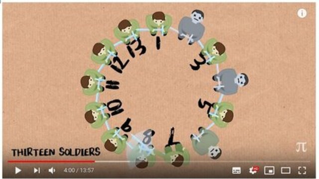

# Princesa2 com lista ligada

[](https://www.youtube.com/watch?v=uCsD3ZGzMgE)

Esse jogo é equivalente ao V1 porém com duas diferenças.

- Números positivos e negativos se alternam. Se tivermos 5 participantes e o primeiro for negativo, então nosso vetor será:
  - `[ -1 2 -3 4 -5 ]`
- O valor de F, denominado fase, poderá ter os valor 1 ou -1 e indica se o primeiro participante será positivo ou negativo.
- Se a espada estiver com um participante com número negativo:
  - Ele deverá matar o participantes à sua esquerda.
  - Depois deverá passar a espada para o participante à sua esquerda.
- Se a espada estiver com um participante de número positivo
  - Ele deverá matar o participante à sua direita no vetor.
  - Depois passar a espada para o participante a sua direita.

___

- Entrada:
  - Os valores de **N** e **E** e **F** na primeira linha.
- Saída:
  - Etapa a etapa, os elementos que estão vivos na fila circular.
    - Indicando com um > ou < quem está com a espada dependendo se é positivo ou negativo.

___

## Exemplos

<!-- load tests.toml --tests 3 -->
```py
>>>>>>>> INSERT
3 1 1
======== EXPECT
[ 1> -2 3 ]
[ 1 3> ]
[ 3> ]
<<<<<<<< FINISH
```

```py
>>>>>>>> INSERT
3 2 1
======== EXPECT
[ 1 <-2 3 ]
[ -2 3> ]
[ 3> ]
<<<<<<<< FINISH
```

```py
>>>>>>>> INSERT
3 3 1
======== EXPECT
[ 1 -2 3> ]
[ <-2 3 ]
[ <-2 ]
<<<<<<<< FINISH
```
<!-- load -->
