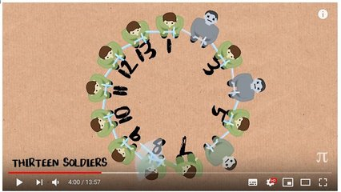

# L2 - @princesa-lista

[](https://www.youtube.com/watch?v=uCsD3ZGzMgE)

Um problema bem interessante e antigo da matemática é conhecido como Josephus Problem. No link da imagem você pode, por curiosidades aprender bastantes sobre ele e o modelo matemático que se propõe a modelá-lo.

Nosso objetivo aqui será apenas implementar seu funcionamento.

___

No problema, **N** pessoas se colocam numa fila circular e assumem valores de 1 até **N**. Um número **E** é escolhido para iniciar o jogo. **E** pega a espada, mata o elemento à sua frente e passa a espada uma posição à frente. O jogo continua até que um único elemento permaneça vivo.

___

- Entrada:
  - Os valores de **N** e **E** na primeira linha.
- Saída:
  - Etapa a etapa, os elementos que estão vivos na fila circular, indicando com um > quem está com a espada.

___

## Implementação usando listas

Resolva novamente o problema utilizando

- a lista do c++ para colocar os elementos
- um iterator para rastrear a posição da espada
- o método erase da lista para matar os elementos

## Ajuda

```cpp
//uma lista de inteiros pode ser criada com
list<int> lista;

//a lista possui funções para inserir ou remover do começo ou do fim
lista.push_front(4);
lista.push_back(5);
lista.pop_front();
lista.pop_back();

//containers em c++ possui iteradores que são classes 
//que servem pra percorrer as estrururas de dados
//elas funcionam com uma sintaxe parecida com ponteiros

//it aponta para o primeiro elemento válido da lista
//list<list>::iterator é o tipo de dado
list<list>::iterator it = lista.begin();

//andar para o próximo elemento da lista pode ser feito com
it++;
//andar pra trás com 
it--;

//lista.end() aponta para o nó de marcação no fim da lista, 
//que é um nó depois do último válido
//Dá pra percorrer imprimindo usando iteradores também
for(auto it = lista.begin(); it != lista.end(); ++it)
    cout << *it;

//para remover um elemento voce usa a operação erase
//ela apaga o nó que está sob o iterador e retorna o nó
//que ficou no lugar dele
it = lista.erase(it);
```

___
Testes:

```txt
>>>>>>>> 01
3 1
========
[ 1> 2 3 ]
[ 1 3> ]
[ 3> ]
<<<<<<<<

>>>>>>>> 02
3 2
========
[ 1 2> 3 ]
[ 1> 2 ]
[ 1> ]
<<<<<<<<

>>>>>>>> 03
3 3
========
[ 1 2 3> ]
[ 2> 3 ]
[ 2> ]
<<<<<<<<

>>>>>>>> 04
6 3
========
[ 1 2 3> 4 5 6 ]
[ 1 2 3 5> 6 ]
[ 1> 2 3 5 ]
[ 1 3> 5 ]
[ 1> 3 ]
[ 1> ]
<<<<<<<<

>>>>>>>> 05
9 9
========
[ 1 2 3 4 5 6 7 8 9> ]
[ 2> 3 4 5 6 7 8 9 ]
[ 2 4> 5 6 7 8 9 ]
[ 2 4 6> 7 8 9 ]
[ 2 4 6 8> 9 ]
[ 2> 4 6 8 ]
[ 2 6> 8 ]
[ 2> 6 ]
[ 2> ]
<<<<<<<<

>>>>>>>> 06
20 1
========
[ 1> 2 3 4 5 6 7 8 9 10 11 12 13 14 15 16 17 18 19 20 ]
[ 1 3> 4 5 6 7 8 9 10 11 12 13 14 15 16 17 18 19 20 ]
[ 1 3 5> 6 7 8 9 10 11 12 13 14 15 16 17 18 19 20 ]
[ 1 3 5 7> 8 9 10 11 12 13 14 15 16 17 18 19 20 ]
[ 1 3 5 7 9> 10 11 12 13 14 15 16 17 18 19 20 ]
[ 1 3 5 7 9 11> 12 13 14 15 16 17 18 19 20 ]
[ 1 3 5 7 9 11 13> 14 15 16 17 18 19 20 ]
[ 1 3 5 7 9 11 13 15> 16 17 18 19 20 ]
[ 1 3 5 7 9 11 13 15 17> 18 19 20 ]
[ 1 3 5 7 9 11 13 15 17 19> 20 ]
[ 1> 3 5 7 9 11 13 15 17 19 ]
[ 1 5> 7 9 11 13 15 17 19 ]
[ 1 5 9> 11 13 15 17 19 ]
[ 1 5 9 13> 15 17 19 ]
[ 1 5 9 13 17> 19 ]
[ 1> 5 9 13 17 ]
[ 1 9> 13 17 ]
[ 1 9 17> ]
[ 9> 17 ]
[ 9> ]
<<<<<<<<


```
