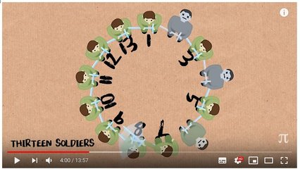

# Princesa v1

[](https://www.youtube.com/watch?v=uCsD3ZGzMgE)

[](solver.cpp)
Um problema bem interessante e antigo da matemática é conhecido como Josephus Problem. No link da imagem você pode, por curiosidades aprender bastantes sobre ele e o modelo matemático que se propõe a modelá-lo.

Nosso objetivo aqui será apenas implementar seu funcionamento.

___

No problema, **N** pessoas se colocam numa fila circular e assumem valores de 1 até **N**. Um número **E** é escolhido para iniciar o jogo. **E** pega a espada, mata o elemento à sua frente e passa a espada uma posição à frente. O jogo continua até que um único elemento permaneça vivo.

___

- Entrada:
  - Os valores de **N** e **E** na primeira linha.
- Saída:
  - Etapa a etapa, os elementos que estão vivos na fila circular, indicando com um > quem está com a espada.

___

## Implementação usando vetor

### Abordagem I - Custo O(N * LogN)

- marcando os elementos que morrem.
  - toda vez que alguém morrer, marque 0 no vetor
  - procure pelo próximo elemento vivo a direita

```c
int elementos[size];
//matar equivale a fazer
vivos[pos] = false;
//o próximo vivo seria uma busca pelo próximo vivo depois de pos
int prox = procurar_vivo(elementos, size, pos);
```

### Abordagem II - Custo O(N^2)

- retirando os elementos que morrem e diminuindo o tamanho do vetor.
  - reposicione os elementos "puxando" todos os que estiverem à frente

```c
//faça a funcao matar que remove o elemento do vetor
//perceba que TUDO após pos, vai diminuir em 1
int elementos[size];
matar(elementos, size, pos);
size -= 1;
pos = pos % size; //se ele era o último agora é o zero
```

### Comparação

- Qual dos algoritmos você acha que é mais eficiente?
- Implemente os dois e vá aumentando a instância do problema e veja o resultado.

## Exemplos

<!-- load tests.toml --tests 3 -->
```py
>>>>>>>> INSERT
3 1
======== EXPECT
[ 1> 2 3 ]
[ 1 3> ]
[ 3> ]
<<<<<<<< FINISH
```

```py
>>>>>>>> INSERT
3 2
======== EXPECT
[ 1 2> 3 ]
[ 1> 2 ]
[ 1> ]
<<<<<<<< FINISH
```

```py
>>>>>>>> INSERT
3 3
======== EXPECT
[ 1 2 3> ]
[ 2> 3 ]
[ 2> ]
<<<<<<<< FINISH
```
<!-- load -->
