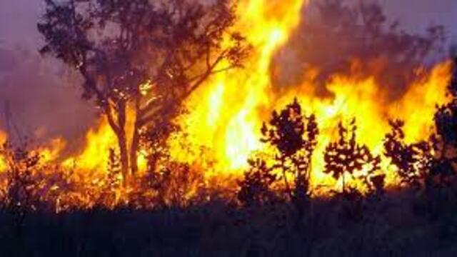

# Pilha: Queimando árvores



- Seja uma matriz de caracteres que representa um mapa de uma floresta.
- Cada caractere representa um espaço vazio ou uma árvore.
- O espaço vazio é representado por um ponto `.` e a árvore por uma hashtag `#`.
- O fogo começa em um ponto inicial e se espalha para os vizinhos até que não haja mais árvores para queimar.

Dado a matriz da floresta e o ponto inicial onde começa o fogo, queime as árvores. O fogo não se espalha nas diagonais, apenas nas 4 direções cardeais.

## Entrada

- 1a linha: `nl, nc, l, c`:
  - Número de linhas e colunas da matriz, linha e coluna onde começa o fogo.
- Nas linhas subsequentes a matriz da floresta sendo que
  - '\#' representa uma árvore
  - '.' representa um espaço vazio

## Saída

- A matriz após a queimada acontecer colocando 'o' para cada árvore queimada.

## Exemplos

<!-- load tests.toml --tests 3 -->
```py
>>>>>>>> INSERT
2 3 1 1
#.#
.##
======== EXPECT
#.o
.oo
<<<<<<<< FINISH
```

```py
>>>>>>>> INSERT
5 5 0 0
#..#.
#...#
###..
..#.#
..###
======== EXPECT
o..#.
o...#
ooo..
..o.o
..ooo
<<<<<<<< FINISH
```

```py
>>>>>>>> INSERT
5 7 2 0
#..#.#.
#..####
###...#
..#.###
#.###..
======== EXPECT
o..o.o.
o..oooo
ooo...o
..o.ooo
#.ooo..
<<<<<<<< FINISH
```
<!-- load -->
