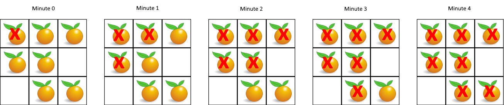

# LeetCode 994. Rotting Oranges

## Intro

Você recebe uma grade `m x n` onde cada célula pode ter um dos três valores:

- `0` representa uma célula vazia,  
- `1` representa uma laranja fresca,  
- `2` representa uma laranja podre.  

A cada minuto, qualquer laranja fresca que esteja **adjacente em 4 direções** (cima, baixo, esquerda, direita) a uma laranja podre se torna podre.  

Retorne o número mínimo de minutos necessários até que **nenhuma célula contenha uma laranja fresca**.  
Se isso for impossível, retorne `-1`.


Segue uma representação visual do teste 1.


## Submission

Aqui, copiamos apenas alguns casos de teste do problema original, ao final, submeta seu código no LeetCode [nesse link](https://leetcode.com/problems/rotting-oranges/).

## Tests

```txt
>>>>>>>> INSERT Teste 1
3 3
2 1 1
1 1 0
0 1 1
======== EXPECT
4
<<<<<<<< FINISH


>>>>>>>> INSERT Teste 2
3 3
2 1 1
0 1 1
1 0 1
======== EXPECT
-1
<<<<<<<< FINISH


>>>>>>>> INSERT Teste 3
1 2
0 2
======== EXPECT
0
<<<<<<<< FINISH
```

## Constraints

- `m == grid.length`

- `n == grid[i].length`

- `1 <= m, n <= 10`

- `grid[i][j] é 0, 1 ou 2.`