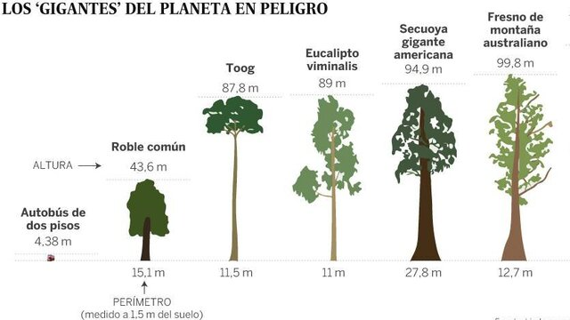

# Soma e Mínimo Recursivos

<!-- toch -->
[Descrição](#descrição) | [Exemplos](#exemplos)
-- | --
<!-- toch -->



## Descrição

Implemente os métodos solicitados no rascunho de acordo com os comentários no código. Essa NÃO é uma árvore binária de busca. É uma árvore binária genérica no qual os nós podem conter quaisquer valores.

## Exemplos

<!-- load tests.toml --tests 3 -->
```py
>>>>>>>> INSERT
4 # # 
======== EXPECT
Arvore:
4
Soma: 4, Minimo: 4
<<<<<<<< FINISH
```

```py
>>>>>>>> INSERT
1 # 0 # # 
======== EXPECT
Arvore:
╭───#
1
╰───0
Soma: 1, Minimo: 0
<<<<<<<< FINISH
```

```py
>>>>>>>> INSERT
4 # 8 2 # # # 
======== EXPECT
Arvore:
╭───#
4
│   ╭───2
╰───8
    ╰───#
Soma: 14, Minimo: 2
<<<<<<<< FINISH
```
<!-- load -->
