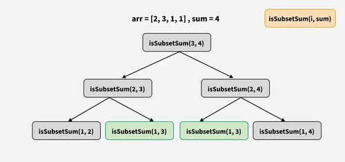

# Soma subconjuntos



O problema da **Soma dos Subconjuntos** consiste em verificar se existe algum subconjunto de um conjunto de inteiros que tenha a soma igual a um valor alvo. É um problema clássico da ciência da computação e pode ser resolvido eficientemente para pequenos conjuntos usando a técnica de **Backtracking**.

## Entrada

A entrada é composta por duas linhas:

- A primeira linha contém um número inteiro `n` ($1 \leq n \leq 20$) e `k` ($1 \leq k \leq 10^4$), representando o número de elementos no conjunto e a soma desejada, respectivamente.
- A segunda linha contém `n` inteiros separados por espaço.  
  $1 \leq a_i \leq 10^4$

## Saída

- Uma resposta contendo "true" se é possível fazer tal soma ou "false" caso contrário.

 É garantido que $\sum_{i = 0}^{n-1} a_i < 2^{31}$

### Exemplo

```txt
>>>>>>>>
5 9
3 34 4 12 5
========
true
<<<<<<<<
```

### Explicação

Para a soma 9 temos $4 + 5 = 9$
