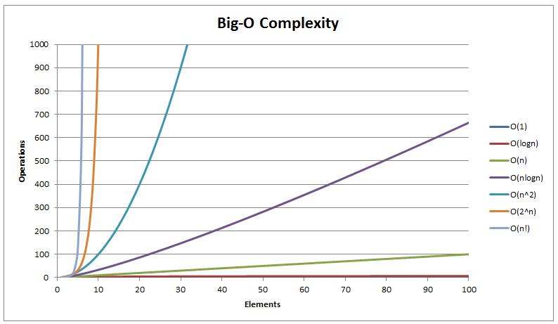

# Análise de Algoritmos

## Introdução e Definição

A análise de algoritmos é uma área fundamental da ciência da computação que se concentra em entender a eficiência dos algoritmos, tanto em termos de tempo quanto de espaço (memória) utilizados. Um algoritmo é uma sequência finita de passos que resolve um problema específico. Avaliar a eficiência dos algoritmos nos ajuda a escolher a melhor solução para um problema dado, especialmente quando lidamos com grandes quantidades de dados. Um bom algoritmo pode superar um algoritmo ruim, mesmo em um hardware inferior, especialmente em instâncias grandes do problema.

## Contagem de Passos

A contagem de passos é uma técnica utilizada para medir a eficiência de um algoritmo contando o número de operações básicas que ele realiza. Para analisar algoritmos, utilizamos o modelo de Máquina de Acesso Aleatório (RAM), que faz as seguintes suposições:

- As instruções são executadas sequencialmente.
- Operações simples (como +, -, *, /, if) levam um passo cada.
- Cada acesso à memória custa um passo.
- Operações com inteiros e ponto flutuante têm o mesmo custo.

### Exemplo 1: Soma de elementos de um array

```cpp
#include <vector>
int somaArray(const std::vector<int>& arr) {
    int soma = 0;
    for (int elemento : arr) {
        soma += elemento;
    }
    return soma;
}
```

Vamos contar os passos para esse algoritmo:

1. `soma = 0`: Executado uma vez.
2. `for (int elemento : arr)`: Executado `n` vezes, onde `n` é o tamanho do array.
3. `soma += elemento`: Executado `n` vezes.
4. `return soma`: Executado uma vez.

Total de passos: $1 + n + n + 1 = 2n + 2$.

### Exemplo 2: Busca linear em um array

```cpp
#include <vector>

int buscaLinear(const std::vector<int>& arr, int valor) {
    for (size_t i = 0; i < arr.size(); ++i) {
        if (arr[i] == valor) {
            return i;
        }
    }
    return -1;
}

```

Vamos contar os passos para esse algoritmo:

1. `for (size_t i = 0; i < arr.size(); ++i)`: No pior caso, executado `n` vezes.
2. `if (arr[i] == valor)`: No pior caso, executado `n` vezes.
3. `return i`: Executado no melhor caso (primeira iteração).
4. `return -1`: Executado uma vez, se o valor não for encontrado.

Total de passos no pior caso: $n + n + 1 = 2n + 1$.

## Eficiência

A análise de algoritmos considera diferentes cenários de execução para avaliar a eficiência de um algoritmo:

- **Melhor caso:** O cenário em que o algoritmo executa o menor número possível de operações. Exemplo: Encontrar o elemento buscado na primeira posição de um array.
- **Pior caso:** O cenário em que o algoritmo executa o maior número possível de operações. Exemplo: Buscar um elemento que não está presente no array.
- **Caso médio:** O cenário em que consideramos a execução média do algoritmo sobre todas as possíveis entradas de tamanho n. Este é frequentemente o caso mais representativo para análise prática.

### Exemplo: Busca Linear

Para o algoritmo de busca linear:

- **Melhor caso:** O elemento está na primeira posição. Tempo de execução: O(1).
- **Pior caso:** O elemento não está no array. Tempo de execução: O(n).
- **Caso médio:** O elemento está em qualquer posição com igual probabilidade. Tempo de execução: O(n/2), que simplifica para O(n).

## Comportamento Assintótico

O comportamento assintótico descreve como a eficiência de um algoritmo muda à medida que o tamanho da entrada cresce indefinidamente. Ele nos permite focar nos termos mais significativos que afetam o desempenho do algoritmo, ignorando constantes e termos de ordem inferior.

**Exemplo:** Para um algoritmo cujo tempo de execução é $2n^2 + 3n + 4$, o comportamento assintótico é dominado pelo termo $n^2$. Assim, dizemos que o tempo de execução é $O(n^2)$.

## Notação Big-O

A notação Big O é usada para descrever como a execução de um algoritmo cresce com o tamanho da entrada. Dizemos que uma função $f(n)$ está em $O(g(n))$ se, a partir de um certo ponto, $f(n)$ nunca cresce mais rápido que uma constante vezes $g(n)$. Formalmente, $ f(n) \in O(g(n))$ se existem constantes positivas $c$ e $n_0$ tais que:

$0 \leq f(n) \leq c \cdot g(n) \quad \text{para todo} \quad n \geq n_0 $

- **O(1)**: Algoritmo constante.
- **O(log n)**: Algoritmo logarítmico.
- **O(n)**: Algoritmo linear.
- **O(n log n)**: Algoritmo linearítmico.
- **O(n²)**: Algoritmo quadrático.
- **O(n³)**: Algoritmo cúbico.
- **O(2^n)**: Algoritmo exponencial.
- **O(n!)**: Algoritmo fatorial.

### Comparação de Funções

| Tamanho n | log₂n | n   | n log₂n | n²    | n³    | 2^n      |
|-----------|-------|-----|---------|-------|-------|----------|
| 10        | 3     | 10  | 30      | 100   | 1000  | 1000     |
| 100       | 6     | 100 | 664     | 10⁴   | 10⁶   | 10³⁰     |
| 10³       | 9     | 10³ | 9965    | 10⁶   | 10⁹   | 10³⁰⁰    |
| 10⁴       | 13    | 10⁴ | 10⁵     | 10⁸   | 10¹²  | 10³⁰⁰⁰   |
| 10⁵       | 16    | 10⁵ | 10⁶     | 10¹⁰  | 10¹⁵  | 10³⁰⁰⁰⁰  |
| 10⁶       | 19    | 10⁶ | 10⁷     | 10¹²  | 10¹⁸  | 10³⁰⁰⁰⁰⁰ |



### Exemplo de Cálculo de Notação Big-O

### Exemplo 1: Mostrar que $2n + 120 \in O(n)$

Queremos mostrar que $2n + 120$ cresce no máximo linearmente, ou seja, como $O(n)$.

- A função $f(n) = 2n + 120$.
- Queremos encontrar constantes $c$ e $n_0$ tal que $2n + 120 \leq c \cdot n$ para $n \geq n_0$.

#### Prova

1. Dividimos ambos os lados da desigualdade por $n$:
$$2 + \frac{120}{n} \leq c$$

2. Para $n \geq 120$, temos $\frac{120}{n} \leq 1$.

3. Assim, $2 + \frac{120}{n} \leq 2 + 1 = 3$.

4. Portanto, se escolhermos $c = 3$ e $n_0 = 120$, a desigualdade $2n + 120 \leq 3n$ é satisfeita para $n \geq 120$.

**Conclusão:** $2n + 120 \in O(n)$.

### Exemplo 2: Soma de elementos de um array

```cpp
#include <vector>

int somaArray(const std::vector<int>& arr) {
    int soma = 0;
    for (int elemento : arr) {
        soma += elemento;
    }
    return soma;
}
```

Analisando o tempo de execução:

- `int soma = 0`: O(1)
- `for (int elemento : arr)`: O(n)
- `soma += elemento`: O(n)
- `return soma`: O(1)

*Tempo total:* $O(1 + n + n + 1) = O(2n + 2) ≈ O(n)$
