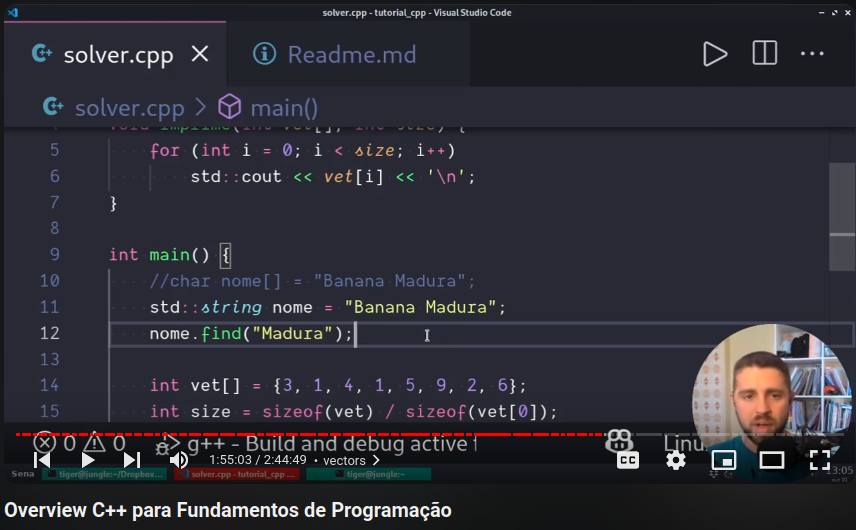

# Objetivos Introdução

Nesse primeiro bloco, vamos aprender ou relembrar os conceitos básicos da linguagem C++. Antes de iniciarmos com exercícios próprios da disciplina de ED, precisamos fixar conceitos e a semântica de como trabalhar com:

- Entrada e Saída
- Seleção e Repetição
- Funções
- Ponteiros e Referência
- Arrays e Vectors

Esse vídeo introdução mostra os principais aspectos da linguagem.

- 00:00:00 introdução
- 00:01:02 compilando hello world manualmente
- 00:03:08 comentários
- 00:03:55 using namespace std
- 00:05:50 entendendo o cout e endl
- 00:08:19 escopo
- 00:10:14 variáveis locais e globais
- 00:11:24 inicialização e atribuição
- 00:13:28 o que acontece se não inicializar
- 00:14:16 utilizando o cin
- 00:16:02 ponteiro de leitura
- 00:18:28 pulando whitespaces
- 00:19:43 uso de const
- 00:21:19 nomeando variáveis e funções
- 00:23:14 tipos básicos
- 00:25:23 sizeof, unsigned e long
- 00:26:37 printf e zeros a esquerda
- 00:27:59 precisão de casas decimais
- 00:29:30 utilizando auto
- 00:31:26 cuidado com casts
- 00:34:14 cast do c ou static cast
- 00:37:41 operadores aritméticos com tipos
- 00:41:10 unário prefixado e posfixado
- 00:45:25 operadores lógicos e condicionais
- 00:47:07 if else
- 00:51:16 operador ternário
- 00:53:58 funções retornam informações
- 00:57:40 funções recebem parâmetros
- 01:00:01 printando dentro da função
- 01:02:39 retorno no meio
- 01:07:38 parâmetros default
- 01:09:56 copia e referência
- 01:12:26 referências constantes
- 01:14:20 DEBUGANDO
- 01:21:08 protótipos de função
- 01:22:49 declaração e definição
- 01:25:19 controles de laço
- 01:27:34 controle do for
- 01:29:03 continue break laço infinito
- 01:37:26 tratando entrada
- 01:41:38 getline pegando linha ou até o token
- 01:45:31 convertendo de string para qualquer tipo
- 01:47:15 convertendo para string
- 01:48:16 arrays estáticos
- 01:50:06 calculando size dinamicamente
- 01:52:30 vetores são passado por endereço
- 01:53:21 strings
- 01:54:59 vectors
- 01:57:20 lendo e preenchendo um vector
- 02:01:32 manipulando vetores com funções
- 02:07:39 enum
- 02:10:20 jokenpo com enum
- 02:13:07 enum para strings
- 02:14:44 std::pair
- 02:21:36 structs
- 02:22:50 acessando dados
- 02:26:27 arquivos
- 02:30:30 matrizes
- 02:32:35 inicializando matrizes
- 02:36:01 typedef
- 02:37:01 números aleatórios random
