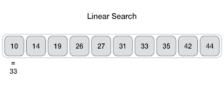
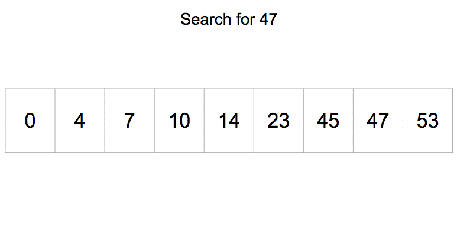

# Algoritmos de Busca

## Introdução

Dada uma chave de busca e uma coleção de elementos, onde cada elemento possui um identificador único, desejamos encontrar o elemento da coleção que possui o identificador igual ao da chave de busca ou verificar que não existe nenhum elemento na coleção com a chave fornecida.

- Nos nossos exemplos a coleção de elementos será representada por um vetor de inteiros.
  - O identificador do elemento será o próprio valor de cada elemento.
- Apesar de usarmos inteiros, os algoritmos que estudaremos servem para buscar elementos em qualquer coleção de elementos que possuam chaves que possam ser comparadas.

## Busca Sequencial



A busca sequencial é o algoritmo mais simples de busca:

- Percorra a lista comparando a chave com os valores dos elementos em cada uma das posições.
- Se a chave for igual a algum dos elementos, retorne a posição correspondente na lista.
- Se a lista toda foi percorrida e a chave não for encontrada, retorne
o valor −1.

### Implementação da Busca Sequencial em C++

````cpp
int buscaSequencial(int A[], int n, int key) {
    int index;

    for (index = 0; index < n; index++) {
        if (A[index] == key) {
            return index;
        }
    }
    return -1;
}
````

## Busca Binária



A busca binária é um algoritmo mais eficiente, entretanto, requer que a lista esteja ordenada pelos valores da chave de busca.

Ideia:

- Verifique se a chave de busca é igual ao valor da posição do meio da lista.
- Caso seja igual, devolva esta posição.
- Caso o valor desta posição seja maior que a chave, então repita o processo, mas considere uma lista reduzida, com os elementos do começo da lista até a posição anterior a do meio.
- Caso o valor desta posição seja menor que chave, então repita o processo, mas considere uma lista reduzida, com os elementos da posição seguinte a do meio até o final da lista.

### Implementação da Busca Binária em C++

````cpp
int buscaBinaria(int A[], int n, int key) {
    int pos_ini = 0;
    int pos_fim = n - 1;
    int pos_meio;

    while (pos_ini <= pos_fim) {
        pos_meio = (pos_ini + pos_fim)/2;

        if (A[pos_meio] == key) {
            return pos_meio;
        }
        else if (A[pos_meio] > key) {
            pos_fim = pos_meio - 1;
        }
        else {
            pos_ini = pos_meio + 1;
        }
    }
    return -1;
}
````

### Implementação da Busca Binária em C++ (Recursivo)

````cpp
int buscaBinaria(int A[], int key, int pos_ini, int pos_fim) {
    if (pos_fim >= pos_ini){
        int pos_meio = (pos_ini + pos_fim)/2;

        if (A[pos_meio] == key) {
            return pos_meio;
        }
        else if (A[pos_meio] > key) {
            return buscaBinaria(A, key, pos_ini, pos_meio - 1);
        }
        else {
            return buscaBinaria(A, key, pos_meio + 1, pos_fim);
        }
    }
    return -1;
}
    
````

## Conclusão

Os algoritmos de busca são essenciais para localizar elementos em uma coleção. A busca sequencial verifica cada elemento até encontrar a chave desejada, enquanto a busca binária divide repetidamente a coleção em partes menores, buscando em uma lista ordenada. A escolha entre eles depende das características dos dados e do contexto de uso.
